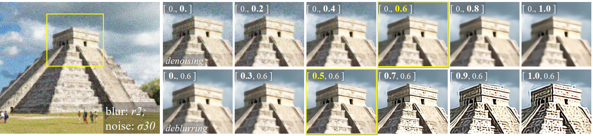
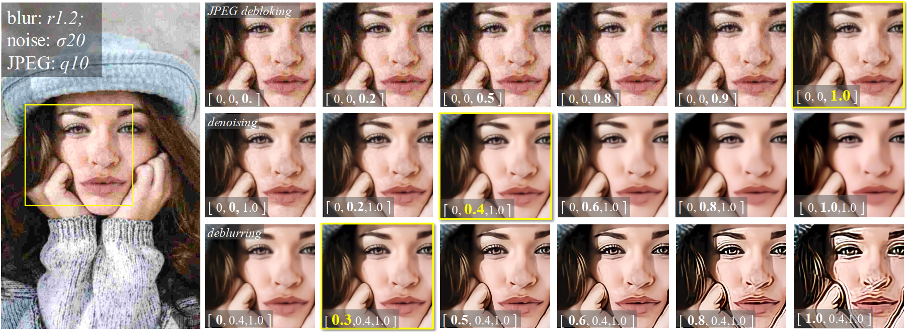
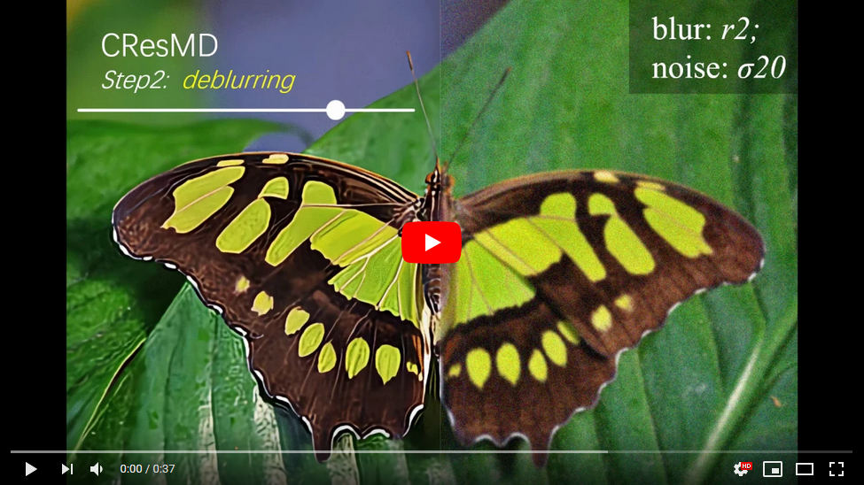

# CResMD

### Multi-Dimension Modulation for Image Restoration with Dynamic Controllable Residual Learning
By Jingwen He, [Chao Dong](https://scholar.google.com.hk/citations?user=OSDCB0UAAAAJ&hl=en), and [Yu Qiao](http://mmlab.siat.ac.cn/yuqiao/)

<p align="center"> 
  
  
  two-dimension modulation
  
</p>

<p align="center">

  
  three-dimension modulation

</p>

<h2 align="center">
Demo video of two-dimension modulation.
</h2>
<p align="center">
<a href="https://www.youtube.com/watch?v=GHkGOkqf1tU" target="_blank">

</a></p>


## Dependencies and Installation

- Python 3 (Recommend to use [Anaconda](https://www.anaconda.com/download/#linux))
- [PyTorch >= 1.0](https://pytorch.org/)
- NVIDIA GPU + [CUDA](https://developer.nvidia.com/cuda-downloads)
- Python packages: `pip install numpy opencv-python lmdb pyyaml`
- TensorBoard:
  - PyTorch >= 1.1: `pip install tb-nightly future`
  - PyTorch == 1.0: `pip install tensorboardX`


## Modulation

1. Modify the configuration file [`options/test/modulation_CResMD.yml`](codes/options/test/modulation_CResMD.yml) 
1. Run command:
```c++
python modulation_CResMD.py -opt options/test/modulation_CResMD.yml
```

## How to Train

### CResMD
1. Prepare datasets, usually the DIV2K dataset.
1. Modify the configuration file [`options/train/train_CResMD.yml`](codes/options/train/train_CResMD.yml)
1. Run command:
```c++
python train_CResMD.py -opt options/train/train_CResMD.yml
```

### base network
1. Prepare datasets, usually the DIV2K dataset. More details are in [`codes/data`](codes/data). 
1. Modify the configuration file [`options/train/train_Base.yml`](codes/options/train/train_Base.yml) 
1. Run command: 
```c++
python train.py -opt options/train/train_Base.yml
```

## How to Test

### CResMD
1. Modify the configuration file [`options/test/test_CResMD.yml`](codes/options/test/test_CResMD.yml) (please refer to [`options`](codes/options) for instructions.)
1. Run command:
```c++
python test.py -opt options/test/test_CResMD.yml
```

### base network
1. Modify the configuration file [`options/test/test_Base.yml`](codes/options/test/test_Base.yml) (please refer to [`options`](codes/options) for instructions.)
1. Run command:
```c++
python test.py -opt options/test/test_Base.yml
```

## Acknowledgement

- This code is based on [mmsr].